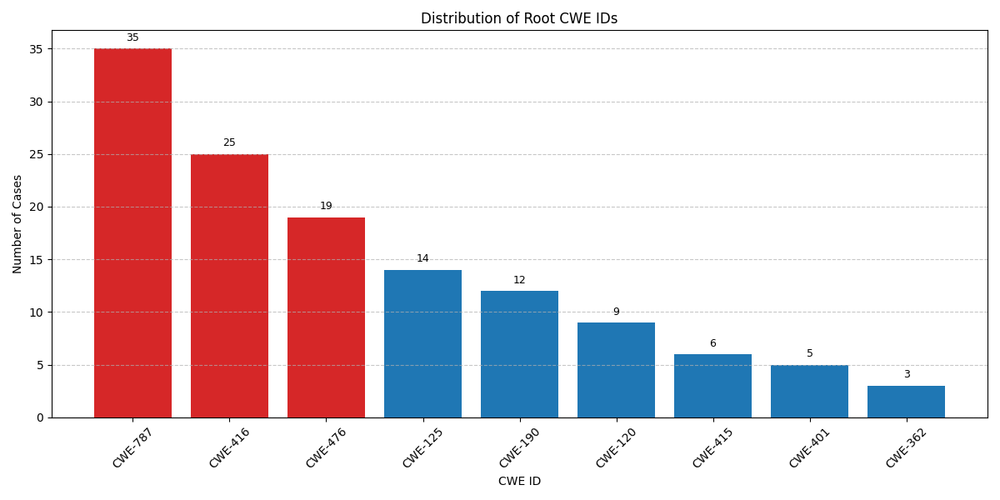

# Sample Distribution

As discussed in Section `4.3_RQ2_Adversarial`, our dataset covers 39 distinct CWE categories. By traversing the CWE-ID hierarchy, we are able to identify the top-level (ancestor) category for each specific CWE-ID. Out of the 274 total cases in our dataset, 128 can be mapped to the official CWE Top 25 list. The remaining cases are associated with CVE identifiers but lack a corresponding CWE mapping. Figure below illustrates the distribution of these top-level CWEs within our dataset.

*Figure: Distribution of Non-Null CWE Samples in the Test Set Mapped to CWE Top-25.*

