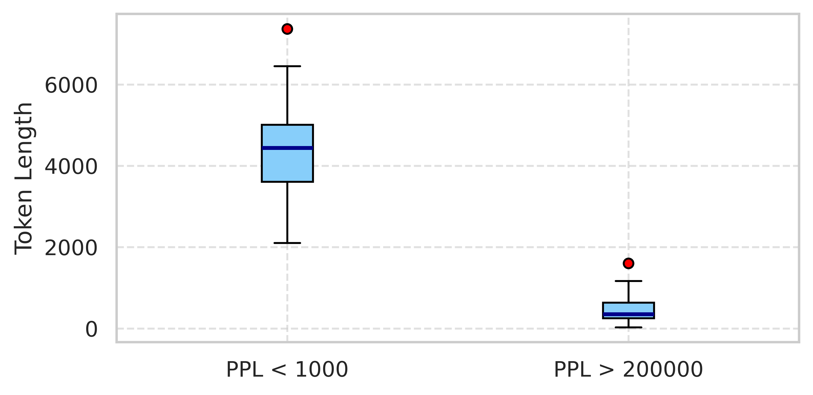

# Code length and model uncertainty

*Figure: The relationship between code snippet length and model uncertainty.*

> [!NOTE]
> Please ensure `Appendix_PPL_vs_TokenLength.png` is placed in the `docs/appendix/assets/` directory.

Perplexity (PPL) is a metric commonly used to measure how confident a language model is when making predictions. In simple terms, it reflects how "confused" the model is when processing a given input. A lower PPL means the model finds the input more predictable or familiar, while a higher PPL indicates that the model is uncertain or surprised by the input.

In the context of code understanding, if a model assigns high perplexity to a code snippet, it suggests the model is unsure how to interpret or complete that code, possibly due to unfamiliar patterns, poor structure, or lack of training exposure. Conversely, low perplexity implies the model can follow the logic more easily.

The figure above illustrates a clear inverse relationship: code snippets with low perplexity (`PPL<1000`) tend to be longer, suggesting that longer, well-structured code can provide better context for the model to understand. On the other hand, code snippets with high perplexity (`PPL>200000`) are typically short and fragmented, making them harder for the model to interpret confidently.
